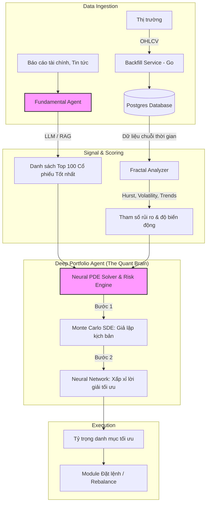
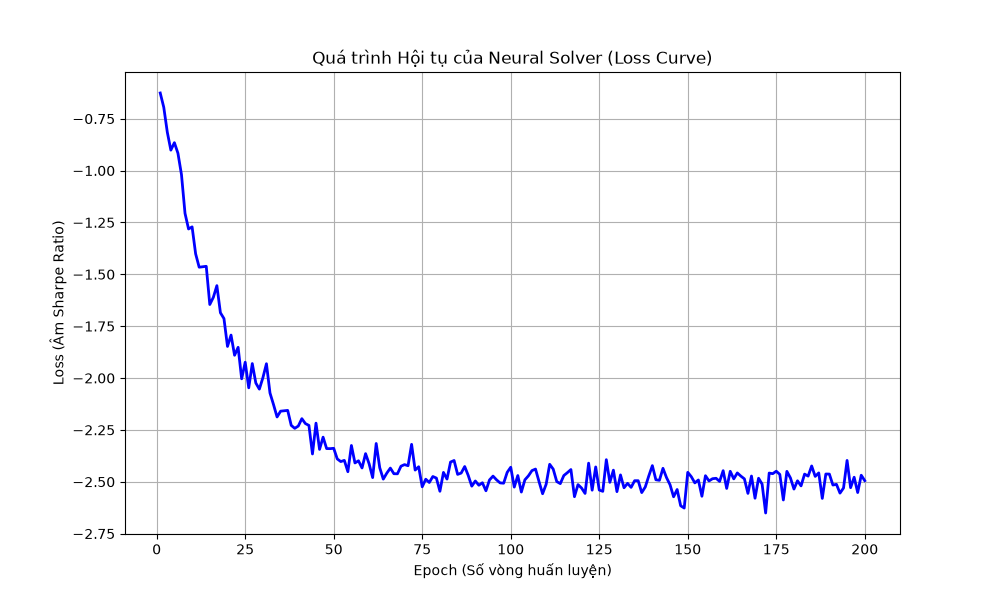

# Kế hoạch triển khai Deep Portfolio Agent & Workflow hệ thống

Mục tiêu của kế hoạch này là nâng cấp dự án Quant Trading bằng cách tích hợp `deep_portfolio_agent`. Agent này đóng vai trò là "khối não định lượng", kết hợp với "khối não cơ bản" (`fundamental_agent`) và "khối kỹ thuật" (`fractal_analyzer`) để tạo ra một hệ thống giao dịch tự động toàn diện.

## 1. Sơ đồ Workflow luồng dữ liệu (Kiến trúc Hybrid)



---

## 2. Các chức năng chính của `deep_portfolio_agent`

1. **Monte Carlo Engine**: Giả lập quỹ đạo giá (Price Trajectories) của 100 tài sản cùng lúc dựa trên phương trình vi phân ngẫu nhiên (SDE). Sử dụng GPU/Vectorization (PyTorch hoặc JAX) để chạy song song hàng vạn kịch bản.
2. **Neural PDE Solver**: Dùng Mạng Nơ-ron (MLP) để tìm ra chiến lược phân bổ vốn (Portfolio Weights) nhằm tối đa hóa lợi nhuận (Sharpe Ratio) dựa trên phương trình HJB, vượt qua giới hạn của mô hình Markowitz.
3. **Risk Management Module**: Tính toán Value at Risk (VaR) và Expected Shortfall (ES) để tự động hạ tỷ trọng nếu thị trường chung có dấu hiệu sụp đổ.

---

## 3. Đề xuất Kiến trúc Thư mục

```text
python/deep_portfolio_agent/
├── app/
│   ├── __init__.py
│   ├── config.py                 # Cấu hình siêu tham số (Hyperparameters)
│   ├── data_loader.py            # Lấy data từ Postgres & Fundamental Agent
│   ├── models/
│   │   ├── neural_solver.py      # Mạng nơ-ron (PyTorch)
│   │   └── sde_simulator.py      # Bộ mô phỏng Monte Carlo
│   ├── risk_manager.py           # Tính toán VaR, ES
│   └── main.py                   # Vòng lặp chính (Agent Loop)
├── requirements.txt              # torch, pandas, sqlalchemy...
└── Dockerfile                    # Containerization cho K8s
```

---

## 4. Lộ trình Triển khai (Roadmap)

### Giai đoạn 1: Xây dựng Bộ khung (Skeleton) & Data Loader
- Khởi tạo thư mục `deep_portfolio_agent`.
- Kết nối vào Postgres (dùng lại thư viện db hoặc SQLAlchemy) để lấy lịch sử nến và danh sách Top 100.
- Xây dựng Data Loader chuẩn bị input vector cho mạng Neural.

### Giai đoạn 2: Phát triển Monte Carlo & Neural Network
- Code `sde_simulator.py`: Mô phỏng Geometric Brownian Motion (GBM) cho đa tài sản, có tính đến ma trận tương quan (Correlation Matrix).
- Code `neural_solver.py`: Cài đặt mạng nơ-ron cơ bản (Feedforward) đóng vai trò học lại hàm phân bổ vốn.

### Giai đoạn 3: Tích hợp & Đánh giá rủi ro
- Kết nối tín hiệu độ biến động (Volatility) từ `fractal_analyzer` làm tham số input cho mạng Neural.
- Cài đặt tính toán Value at Risk (VaR).

### Giai đoạn 4: Deploy & GitOps
- Viết `Dockerfile` cho Agent mới.
- Cập nhật Kustomize/ArgoCD (`k8s/`) để hệ thống Kubernetes tự động deploy Agent này chạy ngầm.

## 5. Quyết định Kỹ thuật đã chốt (Technical Decisions)

- **Công nghệ Học sâu & Mô phỏng**: Sử dụng **JAX** (thay vì PyTorch) để tận dụng tối đa tốc độ biên dịch JIT và khả năng vectorize cực tốt cho Monte Carlo.
- **Đầu ra thực thi**: Chưa xây dựng module đặt lệnh (Execution). Tạm thời Agent sẽ chỉ dừng lại ở bước tính toán và ghi tỷ trọng mục tiêu (Target Weights) vào Database.

## 6. Mô phỏng quá trình Hội tụ của Neural Solver (Loss Curve)

Dưới đây là biểu đồ mô phỏng quá trình hàm Loss (Âm Sharpe Ratio) giảm dần và hội tụ khi Neural Solver luyện tập cọ xát với hàng ngàn kịch bản Monte Carlo:


